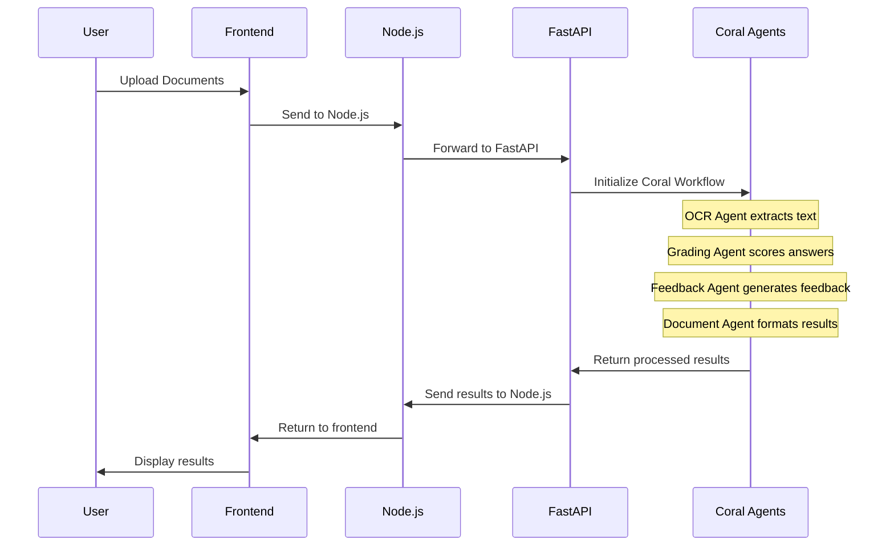

# 🎓 Smart Grade AI - Multi-Agent Educational Assessment Platform

A comprehensive AI-powered educational technology platform that automates grading and assessment using **Coral Protocol** multi-agent orchestration, providing intelligent document processing, automated grading, and personalized feedback generation.

## 🌟 Project Overview

Smart Grade AI is an advanced educational technology platform that combines multiple specialized AI agents working together through the **Coral Protocol** to provide intelligent, automated grading and assessment capabilities. The system can process various document formats, extract text using OCR, grade student answers against rubrics, and provide detailed, personalized feedback.

## 🚀 Technology Stack

### Frontend

- **Framework**: React 18 with Vite
- **UI Library**: Tailwind CSS, Framer Motion
- **Authentication**: Clerk
- **Charts**: Chart.js, Recharts
- **File Processing**: Mammoth, XLSX
- **Animations**: GSAP, Lucide React

### Backend Services

#### Node.js Backend

- **Runtime**: Node.js with Express
- **Database**: MongoDB/Cosmos DB with Mongoose
- **Authentication**: Clerk Integration
- **File Storage**: Cloudinary
- **API Communication**: Axios

#### FastAPI Backend

- **Framework**: FastAPI (Python 3.9+)
- **AI Integration**: LangChain with Azure OpenAI
- **OCR**: Mistral Vision API + PaddleOCR
- **Multi-Agent System**: Coral Protocol
- **Document Processing**: PDF2Image, OpenCV
- **File Storage**: Cloudinary

### Coral Protocol Multi-Agent System

- **Orchestration**: Coral Server
- **Communication**: MCP (Model Context Protocol)
- **Agent Management**: TOML-based configuration
- **Real-time Communication**: Server-Sent Events (SSE)

## 🐠 Coral Protocol Integration

### What is Coral Protocol?

Coral Protocol is a multi-agent communication and orchestration system that enables different AI agents to work together seamlessly. Instead of having isolated services, Coral allows agents to:

- **Communicate**: Share information and results between agents
- **Orchestrate**: Coordinate complex workflows across multiple agents
- **Scale**: Easily add new agents or modify existing ones
- **Monitor**: Track agent status and performance

#### 1. 🖼️ OCR Agent

- **Purpose**: Extract text from documents (PDFs, images)
- **Technology**: Mistral Vision API, PDF2Image
- **Capabilities**: Multi-format document processing, image enhancement

#### 2. 📝 Grading Agent

- **Purpose**: Grade student answers against answer keys and rubrics
- **Technology**: Azure OpenAI GPT-4
- **Capabilities**: Rubric-based scoring, Q&A pair extraction

#### 3. 💬 Feedback Agent

- **Purpose**: Generate constructive feedback for students
- **Technology**: Azure OpenAI GPT-4
- **Capabilities**: Personalized feedback, improvement suggestions

#### 4. 📄 Document Agent

- **Purpose**: Process and format final documents
- **Technology**: Azure OpenAI, PDF generation
- **Capabilities**: Report formatting, metadata extraction

## 🏃‍♂️ Quick Start

### Prerequisites

- **Node.js** 18+ and npm
- **Python** 3.9+
- **Docker** and Docker Compose (optional)
- **API Keys**: Azure OpenAI, Mistral, Cloudinary, Clerk

### 1. Clone and Setup

```bash
git clone <repository-url>
cd smart-grade-ai-fastapi

# Setup environment variables
cp frontend/env.example frontend/.env
cp NodeJsBackend/env.example NodeJsBackend/.env
cp fastapi/env.example fastapi/.env
```

### 2. Environment Configuration

#### Frontend (.env)

```bash
VITE_NODE_SERVER_URL=http://localhost:3000
VITE_FASTAPI_SERVER_URL=http://localhost:8000
VITE_CLERK_PUBLISHABLE_KEY=your_clerk_key
```

#### Node.js Backend (.env)

```bash
PORT=3000
COSMOS_DB_CONNECTION_STRING=your_mongodb_connection
CLOUDINARY_CLOUD_NAME=your_cloudinary_name
CLOUDINARY_API_KEY=your_cloudinary_key
CLOUDINARY_API_SECRET=your_cloudinary_secret
CLERK_SECRET_KEY=your_clerk_secret
FASTAPI_SERVER_URL=http://localhost:8000
```

#### FastAPI (.env)

```bash
# Azure OpenAI
AZURE_OPENAI_API_KEY=your_azure_openai_key
AZURE_OPENAI_ENDPOINT=your_azure_endpoint
AZURE_OPENAI_DEPLOYMENT_NAME=gpt-4

# Mistral API
MISTRAL_API_KEY=your_mistral_key

# Coral Protocol
CORAL_SSE_URL=http://localhost:8080/sse
CORAL_MAIN_AGENT_ID=fastapi-grading-system
CORAL_OCR_AGENT_ID=ocr-agent
CORAL_GRADING_AGENT_ID=grading-agent
CORAL_FEEDBACK_AGENT_ID=feedback-agent
CORAL_DOCUMENT_AGENT_ID=document-agent

# Cloudinary
CLOUDINARY_CLOUD_NAME=your_cloudinary_name
CLOUDINARY_API_KEY=your_cloudinary_key
CLOUDINARY_API_SECRET=your_cloudinary_secret

# Node.js Integration
NODE_SERVER_URL=http://localhost:3000
```

### 3. Development Setup

#### Option A: Docker Compose (Recommended)

```bash
# Start all services
docker-compose up -d

# View logs
docker-compose logs -f
```

#### Option B: Manual Setup

**Start Node.js Backend:**

```bash
cd NodeJsBackend
npm install
npm run dev
```

**Start FastAPI Backend:**

```bash
cd fastapi
python -m venv venv
source venv/bin/activate  # On Windows: venv\Scripts\activate
pip install -r requirements.txt

# Start FastAPI
python -m uvicorn app.main:app --reload --host 0.0.0.0 --port 8000

# Start Coral agents (in another terminal)
./start-coral-agents-simplified.sh
```

**Start Frontend:**

```bash
cd frontend
npm install
npm run dev
```

### 4. Verify Installation

```bash
# Test FastAPI Coral integration
cd fastapi
python test-coral-integration.py

# Test Node.js integration
cd NodeJsBackend
npm run test:integration
```

## 📡 API Endpoints

### FastAPI Coral Protocol Endpoints

| Endpoint                         | Method | Description                           |
| -------------------------------- | ------ | ------------------------------------- |
| `/api/v1/coral/health`           | GET    | Health check for Coral integration    |
| `/api/v1/coral/status`           | GET    | Detailed Coral service status         |
| `/api/v1/coral/grade-with-coral` | POST   | Grade using Coral Protocol workflow   |
| `/api/v1/coral/process-document` | POST   | Process document using Coral workflow |
| `/api/v1/coral/agent-status`     | GET    | Get status of all Coral agents        |
| `/api/v1/coral/test-integration` | POST   | Test the Coral integration            |

### Coral Server Endpoints

| Endpoint           | Method   | Description                   |
| ------------------ | -------- | ----------------------------- |
| `/api/v1/agents`   | GET      | List all available agents     |
| `/api/v1/sessions` | GET/POST | Manage agent sessions         |
| `/api/v1/registry` | GET      | Get agent registry            |
| `/api/v1/health`   | GET      | Health check for Coral server |

### Node.js Backend Endpoints

| Endpoint             | Method  | Description              |
| -------------------- | ------- | ------------------------ |
| `/api/auth/*`        | Various | Authentication endpoints |
| `/api/teachers/*`    | Various | Teacher management       |
| `/api/students/*`    | Various | Student management       |
| `/api/classes/*`     | Various | Class management         |
| `/api/assessments/*` | Various | Assessment management    |

## 🔄 Complete Workflow

### 1. Document Upload Process



### 2. Coral Agent Communication

```python
# Simplified Coral Workflow
async def coral_grading_workflow():
    # 1. Initialize Coral connection
    coral_service = await CoralService().initialize()

    # 2. Create thread for agent communication
    thread_id = await coral_service.create_thread(
        "grading_session",
        ["ocr-agent", "grading-agent", "feedback-agent", "document-agent"]
    )

    # 3. Send document to OCR agent
    await coral_service.send_message(
        thread_id,
        f"Process document: {document_path}",
        mentions=["ocr-agent"]
    )

    # 4. Wait for OCR results
    ocr_response = await coral_service.wait_for_mentions()

    # 5. Send to grading agent
    await coral_service.send_message(
        thread_id,
        f"Grade this text: {ocr_response}",
        mentions=["grading-agent"]
    )

    # 6. Continue workflow...
```

## 🧪 Usage Examples

### Grade with Coral Protocol

```bash
curl -X POST "http://localhost:8000/api/v1/coral/grade-with-coral" \
  -H "Content-Type: multipart/form-data" \
  -F "answer_file=@student_answer.pdf" \
  -F "key_file=@answer_key.pdf" \
  -F "rubric={\"questions\":[{\"questionNumber\":1,\"questionText\":\"What is photosynthesis?\",\"totalMarks\":10,\"rubric\":{\"accuracy\":\"50%\",\"completeness\":\"30%\",\"clarity\":\"20%\"}}]}" \
  -F "student_name=John Doe" \
  -F "exam_title=Biology Test"
```

### Process Document Only

```bash
curl -X POST "http://localhost:8000/api/v1/coral/process-document" \
  -H "Content-Type: multipart/form-data" \
  -F "document_file=@assignment.pdf" \
  -F "processing_type=qa_extraction"
```

### Check System Status

```bash
# Check Coral agents
curl -X GET "http://localhost:8000/api/v1/coral/agent-status"

# Check Coral server
curl -X GET "http://localhost:8000/api/v1/agents"

# Check system health
curl -X GET "http://localhost:8000/api/v1/health"
```

## 🏗️ Project Structure

```
smart-grade-ai-fastapi/
├── frontend/                 # React frontend application
│   ├── src/
│   │   ├── components/       # Reusable UI components
│   │   ├── pages/           # Page components
│   │   └── assets/          # Static assets
│   ├── package.json         # Frontend dependencies
│   └── vite.config.js       # Vite configuration
├── NodeJsBackend/           # Node.js backend service
│   ├── Controllers/         # Route controllers
│   ├── Models/             # Database models
│   ├── Routes/             # API routes
│   ├── Middlewares/        # Express middlewares
│   ├── services/           # Business logic services
│   └── package.json        # Backend dependencies
├── fastapi/                # FastAPI backend with Coral Protocol
│   ├── app/                # FastAPI application
│   │   ├── api/            # API endpoints
│   │   ├── services/       # Business logic services
│   │   ├── models/         # Pydantic models
│   │   └── core/           # Core utilities
│   ├── agents/             # Coral Protocol agents
│   │   ├── coral-ocr-agent/        # OCR processing agent
│   │   ├── coral-grading-agent/    # Grading agent
│   │   ├── coral-feedback-agent/   # Feedback agent
│   │   └── coral-document-agent/   # Document agent
│   ├── requirements.txt    # Python dependencies
│   └── coral-registry.toml # Agent registry
├── coral-server/           # Coral Protocol server
│   ├── coral-server/       # Coral server implementation
│   └── agents/             # Additional Coral agents
└── docker-compose.yml      # Docker orchestration
```

## 🔧 Configuration & Deployment

### Development

```bash
# Start all services in development mode
docker-compose up -d

# View logs
docker-compose logs -f [service-name]

# Stop services
docker-compose down
```

### Production Deployment

#### Azure Container Instances

```bash
# Deploy to Azure
cd NodeJsBackend
./deploy-to-azure.sh

# Deploy FastAPI
cd fastapi
docker build -t smartgrade-fastapi .
docker run -p 8000:8000 smartgrade-fastapi
```

#### Environment Variables

Ensure all required environment variables are set:

- **Azure OpenAI**: API key, endpoint, deployment name
- **Mistral**: API key for OCR processing
- **Cloudinary**: Cloud storage credentials
- **Clerk**: Authentication service keys
- **Database**: MongoDB/Cosmos DB connection string

## 📊 Monitoring & Debugging

### Health Checks

```bash
# Frontend health
curl -X GET "http://localhost:5173"

# Node.js backend health
curl -X GET "http://localhost:3000/health"

# FastAPI health
curl -X GET "http://localhost:8000/api/v1/health"

# Coral Protocol health
curl -X GET "http://localhost:8000/api/v1/coral/health"
```

### Agent Monitoring

```bash
# Check Coral agent status
curl -X GET "http://localhost:8000/api/v1/coral/agent-status"

# View agent logs
tail -f fastapi/agents/coral-ocr-agent/ocr-agent.log
tail -f fastapi/agents/coral-grading-agent/grading-agent.log
```

### Debugging

```bash
# Test Coral integration
cd fastapi
python test-coral-integration.py

# Test Node.js integration
cd NodeJsBackend
npm run test:integration

# View Docker logs
docker-compose logs -f [service-name]
```

## 🎯 Key Features

### Coral Protocol Benefits

1. **Multi-Agent Orchestration**: Seamless coordination between specialized agents
2. **Scalable Architecture**: Easy to add new agents or modify existing ones
3. **Fault Tolerance**: Individual agent failures don't break the entire system
4. **Real-time Communication**: Agents can communicate and share data
5. **Monitoring**: Built-in status tracking and health monitoring

### Smart Grade AI Features

1. **Multi-Format Support**: PDF, PNG, JPG document processing
2. **Advanced OCR**: Mistral Vision API for accurate text extraction
3. **Intelligent Grading**: AI-powered rubric-based assessment
4. **Personalized Feedback**: Constructive, encouraging student feedback
5. **PDF Generation**: Automated report creation with results
6. **Cloud Integration**: Cloudinary support for file storage
7. **User Management**: Clerk-based authentication and authorization
8. **Class Management**: Teacher and student organization
9. **Assessment Tracking**: Complete assessment lifecycle management

## 🚀 Future Enhancements

### Planned Features

1. **Real-time Collaboration**: Multiple teachers grading simultaneously
2. **Advanced Analytics**: Detailed performance insights and trends
3. **Custom Rubrics**: Dynamic rubric creation and management
4. **Batch Processing**: Handle multiple documents at once
5. **Integration APIs**: Connect with LMS systems
6. **Mobile App**: React Native mobile application

### Agent Extensions

1. **Translation Agent**: Multi-language support
2. **Plagiarism Agent**: Content similarity detection
3. **Sentiment Agent**: Emotional tone analysis
4. **Complexity Agent**: Question difficulty assessment
5. **Adaptive Agent**: Learning from grading patterns

## 📚 Documentation

- [FastAPI Coral Integration Guide](fastapi/CORAL_INTEGRATION.md)
- [Python 3.9 Compatibility Solution](fastapi/CORAL_PYTHON39_SOLUTION.md)
- [Coral Server Integration Fix](fastapi/CORAL_SERVER_INTEGRATION_FIX.md)
- [API Documentation](http://localhost:8000/docs) (when FastAPI is running)

## 🤝 Contributing

1. Fork the repository
2. Create a feature branch
3. Make your changes
4. Test thoroughly with both unit and integration tests
5. Submit a pull request

## 📄 License

This project is licensed under the MIT License - see the LICENSE file for details.

## 🆘 Support

For support and questions:

1. **Check Documentation**: Review the comprehensive guides in each directory
2. **Run Tests**: Use the provided test scripts to verify functionality
3. **Check Logs**: Monitor agent and service logs for errors
4. **Health Checks**: Verify all services are running and healthy

### Common Issues

1. **Coral Agents Not Starting**: Check Python environment and dependencies
2. **API Connection Issues**: Verify environment variables and network connectivity
3. **Authentication Problems**: Check Clerk configuration and keys
4. **File Upload Issues**: Verify Cloudinary configuration and file permissions

---

**🎉 Smart Grade AI - Revolutionizing educational assessment with AI-powered multi-agent systems!**

_Making education assessment smarter, faster, and more accurate through the power of Coral Protocol and advanced AI technologies._ 🚀
