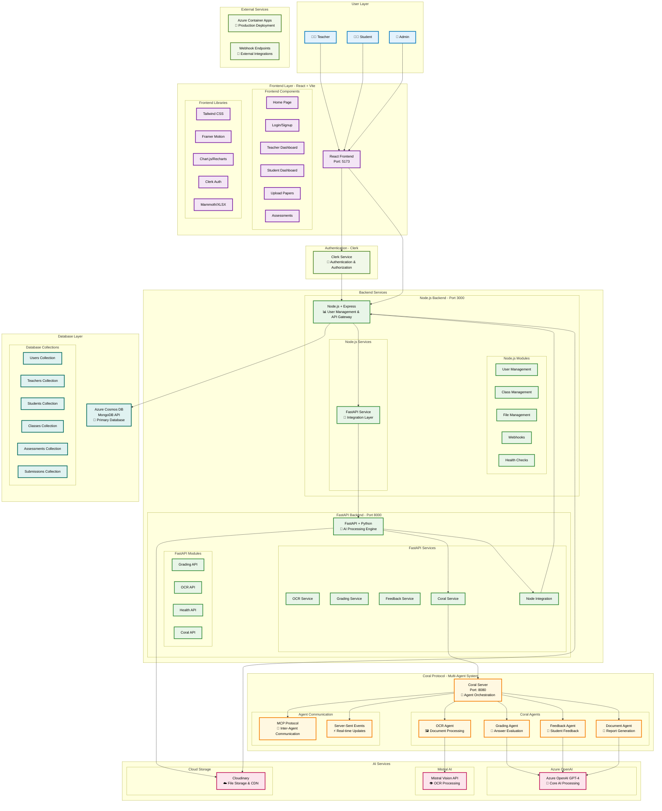

# Smart Grade AI - Detailed Architecture Diagram

## System Overview

Smart Grade AI is a comprehensive AI-powered educational assessment platform that uses Coral Protocol for multi-agent orchestration. The system consists of a React frontend, Node.js backend, FastAPI grading service, and multiple Coral agents working together to provide intelligent document processing, automated grading, and personalized feedback.

## Detailed Architecture Diagram



## Key Architecture Components

### 1. Frontend Layer (React + Vite)

- **Framework**: React 18 with Vite for fast development
- **UI**: Tailwind CSS with Framer Motion animations
- **Authentication**: Clerk integration for user management
- **File Processing**: Mammoth for .docx, XLSX for Excel files
- **Charts**: Chart.js and Recharts for data visualization

### 2. Backend Services

#### Node.js Backend (Port 3000)

- **Role**: API Gateway and User Management
- **Features**: User authentication, class management, file handling
- **Integration**: Communicates with FastAPI for AI processing
- **Database**: Azure Cosmos DB with MongoDB API

#### FastAPI Backend (Port 8000)

- **Role**: AI Processing Engine
- **Features**: Document processing, grading, feedback generation
- **AI Integration**: Azure OpenAI GPT-4, Mistral Vision API
- **Coral Integration**: Orchestrates multi-agent workflows

### 3. Coral Protocol Multi-Agent System

#### Coral Server (Port 8080)

- **Role**: Agent orchestration and communication hub
- **Protocol**: MCP (Model Context Protocol) for inter-agent communication
- **Real-time**: Server-Sent Events for live updates

#### Specialized Agents

1. **OCR Agent**: Document text extraction using Mistral Vision
2. **Grading Agent**: Answer evaluation against rubrics using GPT-4
3. **Feedback Agent**: Personalized student feedback generation
4. **Document Agent**: Report formatting and metadata extraction

### 4. AI Services Integration

- **Azure OpenAI**: GPT-4 for core AI processing (grading, feedback)
- **Mistral Vision**: OCR and document image processing
- **Cloudinary**: File storage, image processing, and CDN

### 5. Database Architecture

- **Azure Cosmos DB**: Primary database with MongoDB API
- **Collections**: Users, Teachers, Students, Classes, Assessments, Submissions
- **Scalability**: Globally distributed, auto-scaling

## Data Flow Architecture

### 1. Document Upload & Processing Flow

```
User Upload → Node.js → FastAPI → Coral Server → OCR Agent → Mistral Vision
                                                         ↓
Grading Results ← Node.js ← FastAPI ← Coral Server ← Grading Agent ← Azure OpenAI
```

### 2. Multi-Agent Workflow

```
Document Input → OCR Agent (Text Extraction)
                    ↓
Grading Agent (Answer Evaluation)
                    ↓
Feedback Agent (Student Feedback)
                    ↓
Document Agent (Report Generation)
```

### 3. Authentication & Authorization Flow

```
User Login → Clerk Authentication → Node.js (Role Assignment) → Frontend (Protected Routes)
```

## Technology Stack Summary

| Layer               | Technology                         | Purpose                  |
| ------------------- | ---------------------------------- | ------------------------ |
| Frontend            | React 18 + Vite                    | User Interface           |
| UI Framework        | Tailwind CSS + Framer Motion       | Styling & Animations     |
| Authentication      | Clerk                              | User Management          |
| API Gateway         | Node.js + Express                  | Backend Services         |
| AI Engine           | FastAPI + Python                   | AI Processing            |
| Agent Orchestration | Coral Protocol                     | Multi-Agent Coordination |
| AI Models           | Azure OpenAI GPT-4, Mistral Vision | AI Processing            |
| Database            | Azure Cosmos DB (MongoDB API)      | Data Storage             |
| File Storage        | Cloudinary                         | File Management          |
| Deployment          | Azure Container Apps               | Cloud Deployment         |

## Key Features

1. **Multi-Agent Architecture**: Coral Protocol enables specialized agents to work together
2. **Intelligent Document Processing**: OCR, grading, and feedback generation
3. **Role-Based Access**: Teacher and student dashboards with appropriate permissions
4. **Real-time Communication**: Server-Sent Events for live updates
5. **Scalable Cloud Architecture**: Azure-based deployment with auto-scaling
6. **Comprehensive API**: RESTful APIs for all major operations
7. **File Format Support**: PDF, DOCX, images, Excel files
8. **Advanced Analytics**: Chart.js integration for performance insights

This architecture provides a robust, scalable, and intelligent educational assessment platform that can handle complex grading workflows while maintaining high performance and user experience.
