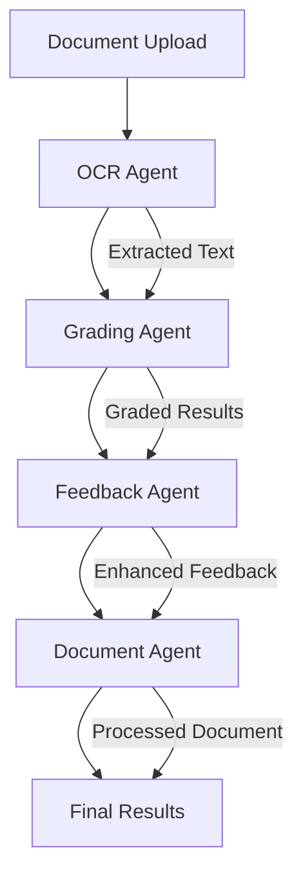

# 🐠 Smart Grade AI - FastAPI with Coral Protocol Integration

A powerful AI-powered grading system that uses **Coral Protocol** for multi-agent orchestration to provide intelligent document processing, grading, and feedback generation.

## 🌟 Overview

Smart Grade AI is an advanced educational technology platform that automates the grading process using multiple specialized AI agents working together through the **Coral Protocol**. This system can process various document formats, extract text using OCR, grade student answers against rubrics, and provide detailed feedback.

## 🏗️ Architecture

### Core Components

1. **FastAPI Backend**: Main web application providing REST API endpoints
2. **Coral Protocol Integration**: Multi-agent orchestration system
3. **Specialized AI Agents**: Four distinct agents working collaboratively
4. **Document Processing Pipeline**: OCR, text extraction, and analysis

### Technology Stack

- **Backend**: FastAPI (Python 3.9+)
- **AI Framework**: LangChain with Azure OpenAI
- **OCR**: Mistral Vision API + PaddleOCR
- **Multi-Agent System**: Coral Protocol (simplified implementation)
- **Document Processing**: PDF2Image, OpenCV
- **Cloud Storage**: Cloudinary

## 🐠 How Coral Protocol Helps

### What is Coral Protocol?

Coral Protocol is a multi-agent communication and orchestration system that enables different AI agents to work together seamlessly. Instead of having isolated services, Coral allows agents to:

- **Communicate**: Share information and results between agents
- **Orchestrate**: Coordinate complex workflows across multiple agents
- **Scale**: Easily add new agents or modify existing ones
- **Monitor**: Track agent status and performance

### Benefits in Smart Grade AI

1. **Modular Design**: Each agent has a specific responsibility
2. **Seamless Communication**: Agents can pass data and results to each other
3. **Scalability**: Easy to add new grading criteria or document types
4. **Reliability**: If one agent fails, others can continue working
5. **Monitoring**: Track the entire grading pipeline from start to finish

## 🤖 Agent Architecture & Flow

### The Four Specialized Agents



### 1. 🖼️ OCR Agent (`coral-ocr-agent`)

**Purpose**: Extract text from documents (PDFs, images)

**Responsibilities**:

- Convert PDFs to images using `pdf2image`
- Process images with Mistral Vision API
- Extract and clean text content
- Handle multiple document formats

**Tools**:

- `extract_text_from_pdf`: Process PDF documents
- `extract_text_from_image`: Extract text from images
- `process_document`: Universal document processor

**Input**: Document files (PDF, PNG, JPG)
**Output**: Extracted and cleaned text

### 2. 📝 Grading Agent (`coral-grading-agent`)

**Purpose**: Grade student answers against answer keys and rubrics

**Responsibilities**:

- Extract question-answer pairs from text
- Compare student answers with answer keys
- Apply rubric-based scoring
- Generate detailed grading results

**Tools**:

- `extract_qa_pairs`: Identify questions and answers
- `grade_with_rubric`: Apply scoring criteria
- `process_text`: Clean and structure text for grading

**Input**: Student answer text, answer key text, rubric
**Output**: Graded results with scores and feedback

### 3. 💬 Feedback Agent (`coral-feedback-agent`)

**Purpose**: Generate constructive feedback for students

**Responsibilities**:

- Analyze student performance
- Identify strengths and areas for improvement
- Generate personalized, encouraging feedback
- Provide actionable suggestions

**Tools**:

- `generate_feedback`: Create comprehensive feedback
- `analyze_strengths`: Identify positive aspects
- `suggest_improvements`: Recommend specific improvements

**Input**: Graded results, student answers
**Output**: Detailed, constructive feedback

### 4. 📄 Document Agent (`coral-document-agent`)

**Purpose**: Process and format final documents

**Responsibilities**:

- Validate document formats
- Extract metadata
- Generate final reports
- Create PDF outputs with results

**Tools**:

- `process_document`: Final document processing
- `extract_metadata`: Get document information
- `validate_format`: Ensure document integrity

**Input**: All previous results and documents
**Output**: Final formatted documents and reports

## 🔄 Complete Workflow

### Step-by-Step Process

1. **Document Upload**

   - Student uploads answer document
   - Teacher uploads answer key
   - Rubric is provided

2. **OCR Processing** (OCR Agent)

   ```
   Document → PDF2Image → Mistral Vision → Extracted Text
   ```

3. **Text Processing** (Grading Agent)

   ```
   Raw Text → Q&A Extraction → Rubric Application → Grading Results
   ```

4. **Feedback Generation** (Feedback Agent)

   ```
   Grading Results → Analysis → Personalized Feedback
   ```

5. **Document Assembly** (Document Agent)
   ```
   All Results → Formatting → Final PDF Report
   ```

### Coral Protocol Flow

```python
# Simplified Coral Workflow
async def coral_grading_workflow():
    # 1. Initialize Coral connection
    coral_service = await CoralService().initialize()

    # 2. Create thread for agent communication
    thread_id = await coral_service.create_thread(
        "grading_session",
        ["ocr-agent", "grading-agent", "feedback-agent", "document-agent"]
    )

    # 3. Send document to OCR agent
    await coral_service.send_message(
        thread_id,
        f"Process document: {document_path}",
        mentions=["ocr-agent"]
    )

    # 4. Wait for OCR results
    ocr_response = await coral_service.wait_for_mentions()

    # 5. Send to grading agent
    await coral_service.send_message(
        thread_id,
        f"Grade this text: {ocr_response}",
        mentions=["grading-agent"]
    )

    # 6. Continue workflow...
```

## 🚀 Quick Start

### Prerequisites

- Python 3.9+
- Virtual environment
- Azure OpenAI API key
- Mistral API key
- Cloudinary account (optional)

### Installation

1. **Clone and Setup**

   ```bash
   cd fastapi
   python -m venv venv
   source venv/bin/activate  # On Windows: venv\Scripts\activate
   pip install -r requirements.txt
   ```

2. **Environment Configuration**

   ```bash
   cp env.example .env
   # Edit .env with your API keys
   ```

3. **Start the System**

   ```bash
   # Start FastAPI server
   python -m uvicorn app.main:app --reload --host 0.0.0.0 --port 8000

   # In another terminal, start Coral agents
   ./start-coral-agents-simplified.sh
   ```

4. **Verify Installation**
   ```bash
   curl -X GET "http://localhost:8000/api/v1/coral/health"
   curl -X GET "http://localhost:8000/api/v1/coral/agent-status"
   ```

## 📡 API Endpoints

### Coral Protocol Endpoints

| Endpoint                         | Method | Description                           |
| -------------------------------- | ------ | ------------------------------------- |
| `/api/v1/coral/health`           | GET    | Health check for Coral integration    |
| `/api/v1/coral/status`           | GET    | Detailed Coral service status         |
| `/api/v1/coral/grade-with-coral` | POST   | Grade using Coral Protocol workflow   |
| `/api/v1/coral/process-document` | POST   | Process document using Coral workflow |
| `/api/v1/coral/agent-status`     | GET    | Get status of all Coral agents        |
| `/api/v1/coral/test-integration` | POST   | Test the Coral integration            |

### Traditional Endpoints

| Endpoint                 | Method | Description                  |
| ------------------------ | ------ | ---------------------------- |
| `/api/v1/grading/grade`  | POST   | Traditional grading endpoint |
| `/api/v1/grading/health` | GET    | Service health check         |

## 🧪 Usage Examples

### 1. Grade with Coral Protocol

```bash
curl -X POST "http://localhost:8000/api/v1/coral/grade-with-coral" \
  -H "Content-Type: multipart/form-data" \
  -F "answer_file=@student_answer.pdf" \
  -F "key_file=@answer_key.pdf" \
  -F "rubric={\"questions\":[{\"questionNumber\":1,\"questionText\":\"What is photosynthesis?\",\"totalMarks\":10,\"rubric\":{\"accuracy\":\"50%\",\"completeness\":\"30%\",\"clarity\":\"20%\"}}]}" \
  -F "student_name=John Doe" \
  -F "exam_title=Biology Test"
```

### 2. Process Document Only

```bash
curl -X POST "http://localhost:8000/api/v1/coral/process-document" \
  -H "Content-Type: multipart/form-data" \
  -F "document_file=@assignment.pdf" \
  -F "processing_type=qa_extraction"
```

### 3. Check Agent Status

```bash
curl -X GET "http://localhost:8000/api/v1/coral/agent-status"
```

## 🔧 Configuration

### Environment Variables

```bash
# Azure OpenAI Configuration
AZURE_OPENAI_API_KEY=your_api_key
AZURE_OPENAI_ENDPOINT=your_endpoint
AZURE_OPENAI_DEPLOYMENT_NAME=gpt-4

# Mistral Configuration
MISTRAL_API_KEY=your_mistral_key

# Coral Protocol Configuration
CORAL_SSE_URL=http://localhost:8080/sse
CORAL_MAIN_AGENT_ID=fastapi-grading-system
CORAL_OCR_AGENT_ID=ocr-agent
CORAL_GRADING_AGENT_ID=grading-agent
CORAL_FEEDBACK_AGENT_ID=feedback-agent
CORAL_DOCUMENT_AGENT_ID=document-agent
```

### Agent Configuration

Each agent has its own `coral-agent.toml` configuration file:

```toml
[agent]
name = "ocr-agent"
version = "1.0.0"
description = "OCR processing agent for document text extraction"

[options.MODEL_API_KEY]
type = "string"
description = "API key for the model provider"

[runtimes.executable]
command = ["python", "main.py"]
```

## 📊 Monitoring & Debugging

### Agent Logs

```bash
# View agent logs
tail -f agents/coral-ocr-agent/ocr-agent.log
tail -f agents/coral-grading-agent/grading-agent.log
tail -f agents/coral-feedback-agent/feedback-agent.log
tail -f agents/coral-document-agent/document-agent.log
```

### Health Checks

```bash
# Check all services
curl -X GET "http://localhost:8000/api/v1/coral/health"
curl -X GET "http://localhost:8000/api/v1/coral/status"
curl -X POST "http://localhost:8000/api/v1/coral/test-integration"
```

### Process Management

```bash
# Start all agents
./start-coral-agents-simplified.sh

# Stop all agents
./stop-coral-agents-simplified.sh

# Check running processes
ps aux | grep "main.py"
```

## 🎯 Key Features

### Coral Protocol Benefits

1. **Multi-Agent Orchestration**: Seamless coordination between specialized agents
2. **Scalable Architecture**: Easy to add new agents or modify existing ones
3. **Fault Tolerance**: Individual agent failures don't break the entire system
4. **Real-time Communication**: Agents can communicate and share data
5. **Monitoring**: Built-in status tracking and health monitoring

### Smart Grade AI Features

1. **Multi-Format Support**: PDF, PNG, JPG document processing
2. **Advanced OCR**: Mistral Vision API for accurate text extraction
3. **Intelligent Grading**: AI-powered rubric-based assessment
4. **Personalized Feedback**: Constructive, encouraging student feedback
5. **PDF Generation**: Automated report creation with results
6. **Cloud Integration**: Cloudinary support for file storage

## 🔍 Troubleshooting

### Common Issues

1. **Agents Not Starting**

   ```bash
   # Check if directories exist
   ls -la agents/

   # Check Python environment
   which python
   python --version
   ```

2. **API Key Issues**

   ```bash
   # Verify environment variables
   echo $AZURE_OPENAI_API_KEY
   echo $MISTRAL_API_KEY
   ```

3. **Port Conflicts**
   ```bash
   # Check if port 8000 is in use
   lsof -i :8000
   ```

### Debug Mode

Enable debug logging by setting:

```bash
export LOG_LEVEL=DEBUG
```

## 🚀 Future Enhancements

### Planned Features

1. **Real-time Collaboration**: Multiple teachers grading simultaneously
2. **Advanced Analytics**: Detailed performance insights and trends
3. **Custom Rubrics**: Dynamic rubric creation and management
4. **Batch Processing**: Handle multiple documents at once
5. **Integration APIs**: Connect with LMS systems

### Agent Extensions

1. **Translation Agent**: Multi-language support
2. **Plagiarism Agent**: Content similarity detection
3. **Sentiment Agent**: Emotional tone analysis
4. **Complexity Agent**: Question difficulty assessment

## 📚 Documentation

- [Coral Protocol Integration Guide](CORAL_INTEGRATION.md)
- [Python 3.9 Compatibility Solution](CORAL_PYTHON39_SOLUTION.md)
- [API Documentation](http://localhost:8000/docs) (when server is running)

## 🤝 Contributing

1. Fork the repository
2. Create a feature branch
3. Make your changes
4. Test thoroughly
5. Submit a pull request

## 📄 License

This project is licensed under the MIT License - see the LICENSE file for details.

## 🆘 Support

For support and questions:

- Check the troubleshooting section
- Review agent logs
- Test individual endpoints
- Verify environment configuration

---

**🎉 Smart Grade AI with Coral Protocol - Making education assessment smarter, faster, and more accurate!**
